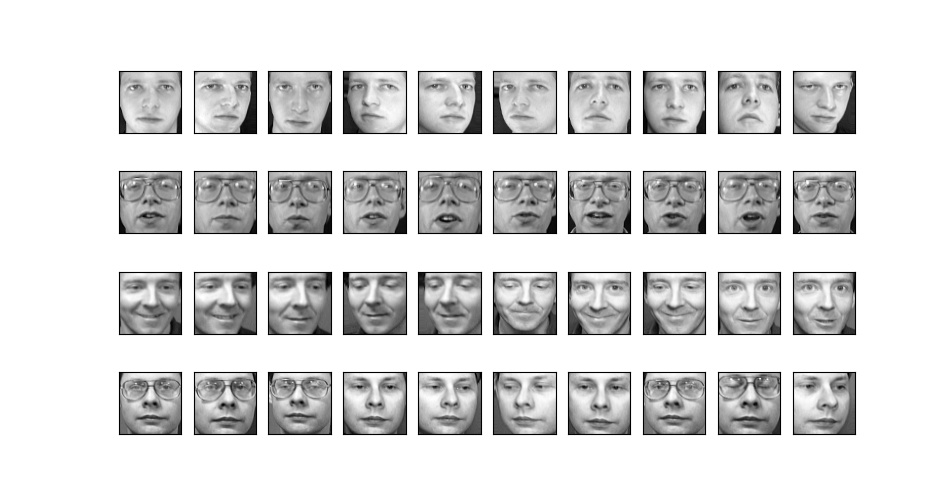
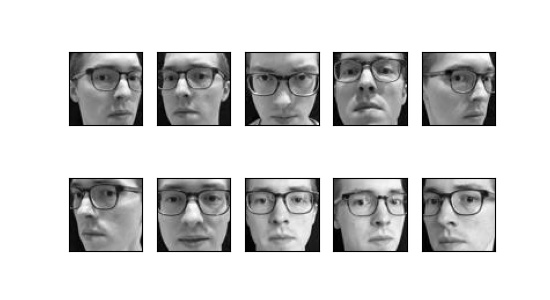
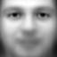
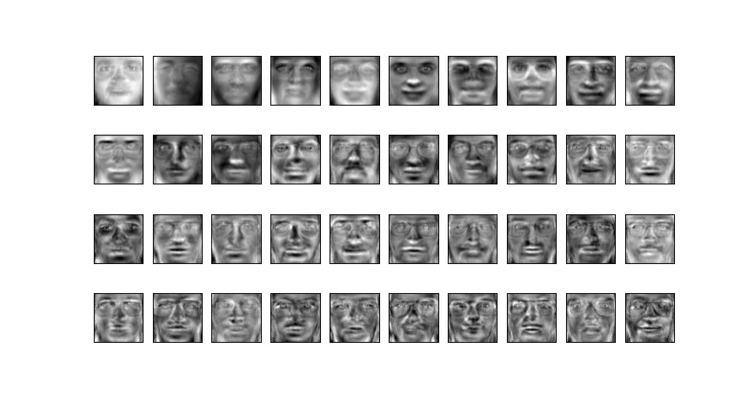
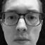
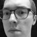

# Eigenfaces
At a high level, we will find the eigenfaces of the input data set. We can think of these as a base set of faces that can be used in linear combinations to represent other faces. We can calculate and store the weight coefficents needed to represent all of the faces in the data set by the eigenfaces. When presented with a new face, we can compute the weight coefficents needed to represent the new face with our eigenfaces. We can perform rudimentary facial recognition by then comparing the computed weights of the new face with the weights of all previously known faces in the database.

## The Data
For this project, we are using the well known Olivetti Faces data set. This data set contains 64x64 pixel grayscale images of 40 individuals. There are 10 images of each indivual exhibiting different facial expressions, angles, and lighting. Here is a sample of the first 4 individuals:

In addition to the standard 400 images, I've also added 10 images of myself to the dataset:

## The Approach
### Setup
We represent each image as one long flattened vector. Our data set is composed of 64x64 images, thus, each image will be represented by a 4096 dimensional vector. We pack all of these vectors into a matrix such that each row represents one of the input images.

### The Mean Face
Next, we need to calculate the mean (average) face of the dataset. This can be done by simply averaging all images across each dimension. This looks something like:

We then proceed to subtract this mean face from each face in our matrix. We can then leverage a singular value decomposition (SVD) on the resulting matrix (transposed) to determine the principal components of the data.

### A Little Aside
If we let $A$ be this transposed matrix of original faces less the mean face, the SVD of $A$ is $A=U\Sigma V^T$, where $U$ and $V$ are orthogonal matrices.

The benefit of using the SVD is that it allows us to avoid computing the covariance matrix $AA^T$. This computation becomes intractable as the number of sample images and the pixel dimensions of each image increase.

The eigenfaces we are searching for are the eigenvectors of $AA^T$. But since $AA^T$ is real and symmetric, we know it has an eigendecomposition $AA^T = Q\Lambda Q^T$. Substituting the SVD of $A$, we can see that:

$$\begin{align*} AA^T &= U\Sigma V^T (U\Sigma V^T)^T \\\\ &=U\Sigma V^T V \Sigma^T U^T \\\\ &=U \Sigma^2 U^T \end{align*}$$

Therefore, it follows that $AA^T = Q\Lambda Q^T = U\Sigma^2 U^T$. Thus, the columns of $U$ constitute the eigenvectors of $AA^T$. We ultimately just want some subset of the columns of $U$, so the SVD will suffice and we can avoid the computation of $AA^T$ entirely.

### Finding the Eigenfaces
We determine the number of eigenfaces we want by using the `rentention` variable passed to the constructor of our `FaceRecognizer` class. We compute the total energy of the matrix $A$, which can be done by summing all the singular values (the diagonal of $\Sigma$). We then just take the first $n$ columns of $U$ such that the sum of the first $n$ corresponding singular values divided by the total energy is the smallest such ratio that is at least equal to `retention`.

In our case, with a desired retention of 0.9, we end up with roughly 270 eigenfaces. Here a sample of what the first 40 look like when reshaped to be 64x64 images:

### Calculating Weights
We can determine the weight of the $k$ th eigenface needed to represent an image by:

$$w_k = (x - m)E_k$$

where $x$ is the input image row vector, $m$ is the mean face vector, and $E_k$ is the $k$ th eigenface (column vector). This simple dot product operation produces a scalar value weight. We repeat this operation for all $n$ eigenfaces to produce a weight vector with $n$ dimensions.

Internally, we have the model compute and store all the weights needed to represent each of the training images, which can be used for future comparisons.

### Using the Model
We can pass in an image that the model has never seen before. The model will then compute the weights of the eigenfaces needed to represent that image, and compare against the stored weights of the training images. Our implementation utilizes the Euclidean distance as the metric for comparing weight vectors. The training image which minimizes the Euclidean distance (i.e., the training image with weights most similar to the input image weights) is selected as a match.

### Success
As a test, we can pass in a previously unseen image of myself to the model:

And in response, the model returns:

Thus, we have a positive identification.
